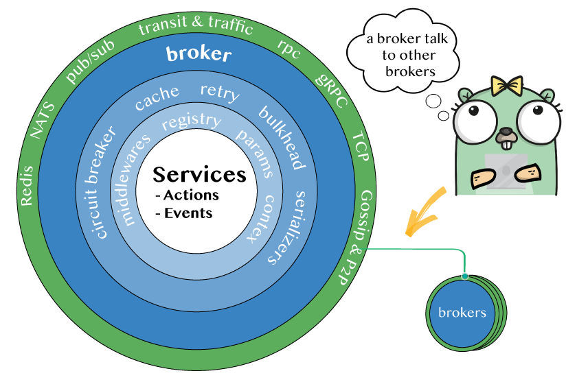

# Broker

The `Broker` is the main component of Moleculer.

Is where you publish your services, calls actions, emits events and communicates with other brokers.

<div align="center">
    
</div>

## Create a broker

**Broker lifecycle**

```go
import (
 "github.com/moleculer-go/moleculer"
 "github.com/moleculer-go/moleculer/broker"
)

bkr := broker.New()
bkr.Publish(services...)
bkr.Start()
bkr.Stop()
```

**Create broker with custom settings:**

```go
import (
 "github.com/moleculer-go/moleculer"
 "github.com/moleculer-go/moleculer/broker"
)

bkr := broker.New(&moleculer.Config{LogLevel: "info"})
```

**Create broker with transporter to communicate with remote nodes:**

```go
import (
 "github.com/moleculer-go/moleculer"
 "github.com/moleculer-go/moleculer/broker"
)

bkr := broker.New(&moleculer.Config{
    LogLevel: "info",
    Transporter: "STAN",
})
```

## Usage

```go
package main

import (
	"github.com/moleculer-go/example-whatsapp/services"
	"github.com/moleculer-go/moleculer"
	"github.com/moleculer-go/moleculer-web"
	"github.com/moleculer-go/moleculer/broker"
	"github.com/moleculer-go/moleculer/cli"
	"github.com/spf13/cobra"
)

func main() {
	cli.Start(
        &moleculer.Config{LogLevel: "debug"},
        //handler called when cli has loaded broker settings
        //and is now ready to start
        func(broker *broker.ServiceBroker, cmd *cobra.Command) {
            broker.Publish(&gateway.HttpService{})
            broker.Publish(services.Login)
            broker.Publish(services.Chat)
            broker.Publish(services.Session)
            broker.Publish(services.Contacts)
            broker.Start()
        })
}
```

## Broker options

List of all available broker options:

| Name                         | Type                      | Default         | Description                                                                                                                   |
| ---------------------------- | ------------------------- | --------------- | ----------------------------------------------------------------------------------------------------------------------------- |
| `Namespace`                  | `string`                  | `random string` | Namespace of nodes to segment your nodes on the same network.                                                                 |
| `DiscoverNodeID`             | `func`                    | `random string` | Unique node identifier. Must be unique in a namespace.                                                                        |
| `LogLevel`                   | `string`                  | `info`          | Log level for built-in logger (trace, debug, info, warn, error, fatal).                                                       |
| `LogFormat`                  | `string`                  | `TEXT`          | Log formatter for built-in console logger. Values: `TEXT`, `JSON`                                                             |
| `Transporter`                | `string`                  | `MEMORY`        | Predefined transporter name. [Read more](networking.html).                                                                    |
| `TransporterFactory`         | `func`                    | `nil`           | Transporter factory. You can create your own transporter or use new transporters                                              |
| `MCallTimeout`               | `time.Duration`           | `5 secs`        | Timeout period for multiple calls ctx.MCall(...)                                                                              |
| `RetryPolicy`                | `struct`                  |                 | Retry policy settings. [Read more](fault-tolerance.html#Retry)                                                                |
| `MaxCallLevel`               | `int`                     | `100`           | Limit of calling level. If it reaches the limit, broker will throw an `MaxCallLevelError` error. _(Infinite loop protection)_ |
| `HeartbeatFrequency`         | `time.Duration`           | `15 secs`       | Period to send heartbeat packet to other nodes.                                                                               |
| `HeartbeatTimeout`           | `time.Duration`           | `30 secs`       | Period to wait before setting node to unavailable status.                                                                     |
| `OfflineCheckFrequency`      | `time.Duration`           | `20 secs`       | Period to check for off-line nodes.                                                                                           |
| `NeighboursCheckTimeout`     | `time.Duration`           | `2 secs`        | Period to wait for neighbours. Used during registry bootstrap and self-discovery.                                             |
| `WaitForDependenciesTimeout` | `time.Duration`           | `2 secs`        | Period to wait for dependencies (other services) to be found. This value is used when starting a new service.                 |
| `Metrics`                    | `Boolean`                 | `false`         | Enable [metrics](metrics.html) function.                                                                                      |
| `MetricsRate`                | `float32`                 | `1`             | Rate of metrics calls. `1` means to measure every request. `0.5` means to measure half of the requests.                       |
| `DisableInternalServices`    | `Boolean`                 | `true`          | Register [internal services](services.html#Internal-services).                                                                |
| `DisableInternalMiddlewares` | `Boolean`                 | `true`          | Register [internal middlewares](middlewares.html#Internal-middlewares).                                                       |
| `DontWaitForNeighbours`      | `Boolean`                 | `false`         | Tell if the broker will wait for neighbours during start-up.                                                                  |
| `WaitForNeighboursInterval`  | `time.Duration`           | `200 millisecs` | Period to wait for neighbours.                                                                                                |
| `Middlewares`                | `[]moleculer.Middlewares` | `empty`         | Register middlewares.                                                                                                         |
| `Created`                    | `func`                    | `no op`         | Fired when the broker is created.                                                                                             |
| `Started`                    | `func`                    | `no op`         | Fired when the broker started.                                                                                                |
| `Stopped`                    | `func`                    | `no op`         | Fired when the broker stopped.                                                                                                |


These options are not fully implemented and tested yet:

| Name                           | Type                             | Default          | Description                                                                                                                                                                                                       |
| ------------------------------ | -------------------------------- | ---------------- | ----------------------------------------------------------------------------------------------------------------------------------------------------------------------------------------------------------------- |
| `RequestTimeout`               | `time.Duration`                  | `0`              | Period to wait before reject a request with a `RequestTimeout` error. Disabled: `0`                                                                                                                               |
| `Tracking`                     | `struct`                         |                  | Tracking requests and waiting for running requests before shutdowning. [Read more](fault-tolerance.html)                                                                                                          |
| `Registry`                     | `Object`                         |                  | Settings of [Service Registry](registry.html)                                                                                                                                                                     |
| `circuitBreaker`               | `Object`                         |                  | Settings of [Circuit Breaker](fault-tolerance.html#Circuit-Breaker)                                                                                                                                               |
| `bulkhead`                     | `Object`                         |                  | Settings of [bulkhead](fault-tolerance.html#Bulkhead)                                                                                                                                                             |
| `transit.maxQueueSize`         | `Number`                         | `50000`          | A protection against inordinate memory usages when there are too many outgoing requests. If there are more than _stated_ outgoing live requests, the new requests will be rejected with `QueueIsFullError` error. |
| `transit.disableReconnect`     | `Boolean`                        | `false`          | Disables the reconnection logic while starting a broker                                                                                                                                                           |
| `transit.packetLogFilter`      | `Array`                          | `empty`          | Filters out the packets in debug logs                                                                                                                                                                             |
| `cacher`                       | `String` or `Object` or `Cacher` | `null`           | Cacher settings. [Read more](caching.html)                                                                                                                                                                        |
| `serializer`                   | `String` or `Serializer`         | `JSONSerializer` | Instance of serializer. [Read more](networking.html)                                                                                                                                                              |
| `skipProcessEventRegistration` | `Boolean`                        | `false`          | Skip the [default](https://github.com/moleculer-go/moleculer/blob/master/src/service-broker.js#L234) graceful shutdown event handlers. In this case you have to register them manually.                           |
| `validation`                   | `Boolean`                        | `true`           | Enable [parameters validation](validating.html).                                                                                                                                                                  |
| `validator`                    | `Validator`                      | `null`           | Custom Validator class for validation.                                                                                                                                                                            |

### Example Config

```go
import (
 "github.com/moleculer-go/moleculer"
 "github.com/moleculer-go/moleculer/broker"
)

bkr := broker.New(&moleculer.Config{
	LogLevel:                   "INFO",
	LogFormat:                  "TEXT",
	DiscoverNodeID:             discoverNodeID,
	Transporter:                "MEMORY",
	HeartbeatFrequency:         15 * time.Second,
	HeartbeatTimeout:           30 * time.Second,
	OfflineCheckFrequency:      20 * time.Second,
	NeighboursCheckTimeout:     2 * time.Second,
	WaitForDependenciesTimeout: 2 * time.Second,
	Metrics:                    false,
	MetricsRate:                1,
	DisableInternalServices:    false,
	DisableInternalMiddlewares: false,
	Created:                    func() {},
	Started:                    func() {},
	Stopped:                    func() {},
	MaxCallLevel:               100,
	RetryPolicy: RetryPolicy{
		Enabled: false,
	},
	RequestTimeout:            0,
	MCallTimeout:              5 * time.Second,
	WaitForNeighboursInterval: 200 * time.Millisecond,
})
```

## Examples

-   [Moleculer DB Examples](https://github.com/moleculer-go/moleculer-db/blob/master/examples/usersMongo/users.service.go)
-   [WhatsApp Example](https://github.com/moleculer-go/example-whatsapp/blob/master/cli/whatsapp_service.go)
-   [Broker Integration Tests](https://github.com/moleculer-go/moleculer/blob/develop/broker/broker_test.go)
