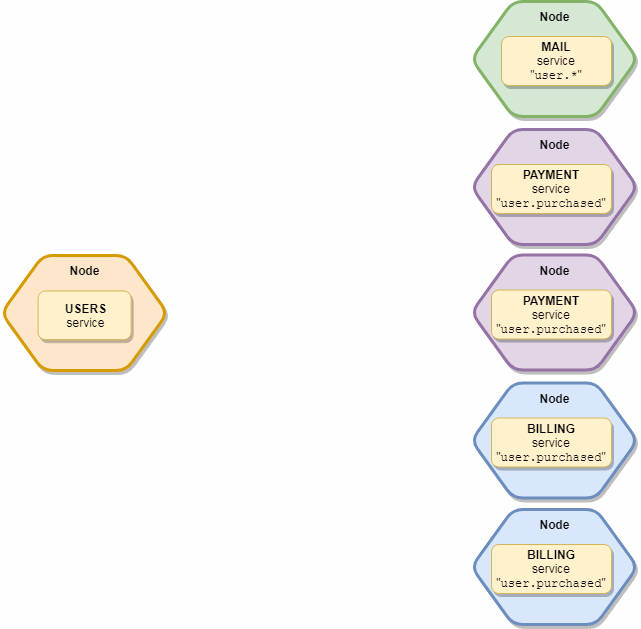

# Events

---

Events are a key component of Moleculer and they are designed to support [Event-driven architectures](http://microservices.io/patterns/data/event-driven-architecture.html) and you can use to send events to local and remote services.

# Balanced events

```go
ctx.Emit("login.sucessfull", p)
```

The `broker` will load balance the delivery of `Emit()` events. When you have multiple instances of the same service listening to “login.sucessfull” event only one listener will receive the event.
You can further customize the delivery of events with `groups`.

> **Example:** Given 2 services: `users` & `payments`. Both subscribe to the `user.created` event. You start 3 instances from `users` service and 2 instances from `payments` service. When you emit the `user.created` event, only one `users` and one `payments` service instance will receive the event.

<div align="center">

</div>

The group name comes from the service name, but it can be overwritten in event definition in services.

**Example**

```go
moleculer.ServiceSchema{
  Name: "payment",
  Events: []moleculer.Event{
    {
      Name: "order.created",
      Group: "other",
      Handler: func(c moleculer.Context, p moleculer.Payload) {
         // ...
      },
    },
  },
}
```

## Emit balanced events

To send balanced events use `broker.Emit(eventName, payload)` or `context.Emit(eventName, payload)` function.

```go
// If there are remote listeners `user` will be serialized to transportation.
// local listeners will be called directly. I does not go near the serialisation or transport.
ctx.Emit("user.created", user)
```

Specify which groups/services receive the event:

```go
// Only the `mail` & `payments` services receives it
ctx.Emit("user.created", user, []string{"mail", "payments"})
```

## Broadcast event

If you broadcast an event all available local & remote listeners will be called.
It is not balanced, all service instances will receive it.

<div align="center">

</div>

Send broadcast events with `broker.Broadcast(name, payload)` or `context.Broadcast(name, payload)` method.

```go
ctx.Broadcast("config.changed", config);
```

Specify which groups/services receive the event:

```go
// Send to all "mail" service instances
ctx.Broadcast("user.created", user, "mail");

// Send to all "user" & "purchase" service instances.
ctx.Broadcast("user.created", user, []string{"user", "purchase"});
```

### Subscribe to events

Use the `Events []moleculer.Event` property of the `moleculer.ServiceSchema` or expose the method `Events() []moleculer.Event` in your `struts`.

```go
paymentService := moleculer.ServiceSchema{
  Name: "payment",
  Events: []moleculer.Event{
    {
      Name: "order.created",
      Handler: func(c moleculer.Context, p moleculer.Payload) { },
    },
  },
}

type CreditService struct {
}

func (s CreditService) Name() string {
    return "credit"
}

func (svc *CreditService) Events() []moleculer.Event {
	return []moleculer.Event{
		{
			Name:    "order.created",
			Handler: func(c moleculer.Context, p moleculer.Payload) { },
		},
	}
}
bkr.Publish(paymentService, &CreditService{})
```

## Internal events

The broker broadcasts some internal events. These events always starts with `$` prefix.

### `$services.changed`

The broker sends this event if the local node or a remote node loads or destroys services.

**Payload**

| Name           | Type   | Description                      |
| -------------- | ------ | -------------------------------- |
| `localService` | `bool` | True if a local service changed. |

### `$circuit-breaker.opened`

The broker sends this event when the circuit breaker module change its state to `open`.

**Payload**

| Name       | Type     | Description       |
| ---------- | -------- | ----------------- |
| `nodeID`   | `string` | Node ID           |
| `action`   | `string` | Action name       |
| `failures` | `number` | Count of failures |

### `$circuit-breaker.half-opened`

The broker sends this event when the circuit breaker module change its state to `half-open`.

**Payload**

| Name     | Type     | Description |
| -------- | -------- | ----------- |
| `nodeID` | `string` | Node ID     |
| `action` | `string` | Action name |

### `$circuit-breaker.closed`

The broker sends this event when the circuit breaker module change its state to `closed`.

**Payload**

| Name     | Type     | Description |
| -------- | -------- | ----------- |
| `nodeID` | `string` | Node ID     |
| `action` | `string` | Action name |

### `$node.connected`

The broker sends this event when a node connected or reconnected.

**Payload**

| Name          | Type                     | Description      |
| ------------- | ------------------------ | ---------------- |
| `node`        | `map[string]interface{}` | Node info object |
| `reconnected` | `bool`                   | Is reconnected?  |

### `$node.updated`

The broker sends this event when it has received an INFO message from a node, (i.e. a service is loaded or destroyed).

**Payload**

| Name   | Type                     | Description      |
| ------ | ------------------------ | ---------------- |
| `node` | `map[string]interface{}` | Node info object |

### `$node.disconnected`

The broker sends this event when a node disconnected (gracefully or unexpectedly).

**Payload**

| Name         | Type                     | Description                                                                         |
| ------------ | ------------------------ | ----------------------------------------------------------------------------------- |
| `node`       | `map[string]interface{}` | Node info object                                                                    |
| `unexpected` | `bool`                   | `true` - Not received heartbeat, `false` - Received `DISCONNECT` message from node. |

### `$broker.started`

The broker sends this event once `broker.start()` is called and all local services are started.

### `$broker.stopped`

The broker sends this event once `broker.stop()` is called and all local services are stopped.

### `$transporter.connected`

The transporter sends this event once the transporter is connected.

### `$transporter.disconnected`

The transporter sends this event once the transporter is disconnected.
