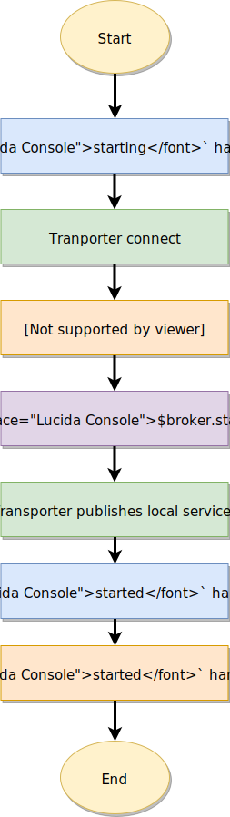
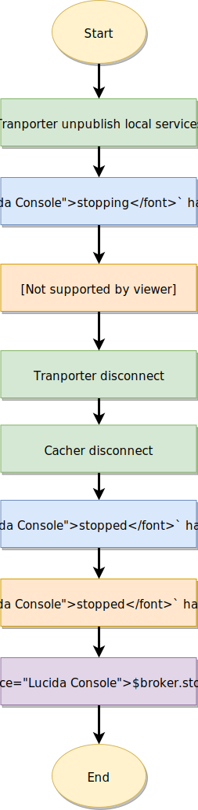

# Lifecycle

---

## Broker lifecycle

This section describes what happens when the broker is starting & stopping.

### Starting logic

The broker starts transporter connecting but it doesn't publish the local service list to remote nodes. When it's done, it starts all services (calls service `started` handler). Once all services start successfully, broker publishes the local service list to remote nodes. Hence remote nodes send requests only after all local service are started properly.

<div align="center">

</div>


Dead-locks can be made when two services wait for each other. E.g.: `users` service has `Dependencies: []string{"posts"}` and `posts` service has `dependencies: []string{"users"}`.


### Stopping logic

When you call `broker.Stop()` or stop the process, at first broker notify the remote nodes, so they can route the requests to other instances instead of services under stopping. Next, the broker starts stopping all local services. After that, the transporter disconnects.

<div align="center">

</div>

## Service lifecycle

This section describes what happens when a service is starting & stopping and how you should use the lifecycle event handler.

### `created` event handler

It is called when the service instance is created (e.g.: at `broker.Publish()`

```go
moleculer.ServiceSchema{
  Name: "www",
  Created: func(c moleculer.Context, p moleculer.Payload) {
    //prepare something important ?
  },
}
```

### `started` event handler

It is triggered when the broker starts all local services. Use it to connect to database, listen servers...etc. In this case the gateway is starting a http server.

```go
type HttpService struct {
  //...
}
// Started httpService started. It process the settings (default + params), starts a http server,
// notify the plugins that the http server is starting.
func (svc *HttpService) Started(context moleculer.BrokerContext, schema moleculer.ServiceSchema) {
  svc.settings = service.MergeSettings(defaultSettings, svc.Settings)
  address := svc.getAddress()
  svc.server = &http.Server{Addr: address}
  svc.router = mux.NewRouter()
  svc.server.Handler = svc.router
  for _, mixin := range svc.Mixins {
    mixin.RouterStarting(context, svc.router)
  }
  svc.reveserProxy(context)
  go svc.startServer(context)
  go populateActionsRouter(context.(moleculer.Context), svc.settings, svc.actionsRouter)

```

### `stopped` event handler

It is called when the broker is stopping all local services. Use it to close and release any resources your service might be using. Files, db, http servers etc.

```go
func (svc *HttpService) Stopped(context moleculer.BrokerContext, schema moleculer.ServiceSchema) {
  if svc.server != nil {
    err := svc.server.Shutdown(nil)
    if err != nil {
      context.Logger().Error("Error shutting down server - error: ", err)
    }
  }
  context.Logger().Info("Gateway stopped()")
}
```
