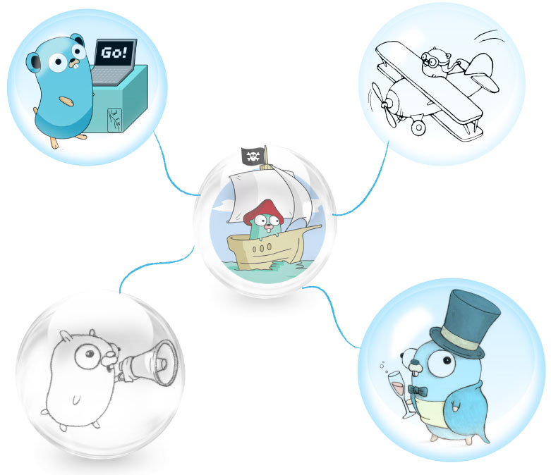

# Services

---

The `Service` represents a microservice in the Moleculer framework. You can define actions and subscribe to events. To create a service can use a schema directly, or use a simple struct.



## Schema

The schema has some main parts: `name`, `version`, `settings`, `actions`, and `events`.

### Simple service schema to define two actions

```go
var mathService = moleculer.ServiceSchema{
  Name: "math",
  Actions: []moleculer.Action{
    {
      Name:  "add",
      Handler: func addAction(ctx moleculer.Context, params moleculer.Payload) interface{} {
        return params.Get("a").Int() + params.Get("b").Int()
      },
    },
    {
      Name:  "sub",
      Handler: func(ctx moleculer.Context, params moleculer.Payload) interface{} {
        return params.Get("a").Int() - params.Get("b").Int()
      },
    },
  },
}
```

## Base properties

The Service has some base properties in the schema.

```go
moleculer.ServiceSchema{
  Name: "posts",
}
```

The `Name` is a mandatory property so it must be defined. It's the first part of action name when you call it.

The `Version` is an optional property. Use it to run multiple version from the same service. It is a prefix in the action name.

```go
moleculer.ServiceSchema{
  Name: "posts",
  Version: "2",
  Actions: []moleculer.Action{
    {
      Name:  "find",
      Handler: ...,
    },
  },
}
```

 `version as prefix on action names is not implemented yet.`

To call this `find` action on version `2` service:

```go
broker.Call("v2.posts.find", nil);
```


Via [API Gateway](moleculer-web.html), make a request to `GET /v2/posts/find`.


## Settings

The `settings` property is a key-value store, where you can store every settings/options to your service.

```go
var instanceSettings map[string]interface{}
moleculer.ServiceSchema{
 Name: "mailer",
 Settings: map[string]interface{}{
  "transport": "mailgun",
 },
 Created: func(s moleculer.ServiceSchema, l *log.Entry) {
  instanceSettings = svc.Settings
 },
 Actions: []moleculer.Action{
  {
   Name:  "send",
   Handler: func(ctx moleculer.Context, p moleculer.Payload) interface{} {
    if instanceSettings["transport"] == "mailgun" {
     //.. do something
    }
   },
  },
 }
}
```

> The `settings` is also obtainable on remote nodes. It is transferred during service discovering.

## Mixins

Mixins are a flexible way to distribute reusable functionalities for Moleculer services. Moleculer will merges the mixins actions, lifecycle methods with the service schema.
In this way you can extend services and resuse functionality. When a service uses mixins, all actions, settings, and lifecycle methods are "mixed" into the service.

**Example using `moleculer-db`**

```go
moleculer.ServiceSchema{
  Name: "users",
  Settings: map[string]interface{}{
    "fields":    []string{"_id", "username", "name"},
    "populates": map[string]interface{}{"friends": "users.get"},
  },
  Mixins: []moleculer.Mixin{
    db.Mixin(&db.MongoAdapter{
      MongoURL:   "mongodb://localhost:27017",
      Collection: "users",
      Database:   "test",
      Timeout:    time.Second * 5,
   })},
  Actions: []moleculer.Action{
  {
   Name:  "notify",
   Handler:...,
  },
 }
}
```

The above example creates an `users` service which inherits all from `db.Mixin`, overwrite the fields and populates setting and expose a new action called `notify`.

### Merge algorithm

The merge algorithm depends on the property type.

| Property                        | Algorithm              |
| ------------------------------- | ---------------------- |
| `Name`, `Version`               | Merge & overwrite.     |
| `Settings`                      | Merge & overwrite.     |
| `Metadata`                      | Merge & overwrite.     |
| `Actions`                       | Merge & overwrite.     |
| `Hooks`                         | Merge & overwrite.     |
| `Events`                        | Concatenate listeners. |
| `Created`, `Started`, `Stopped` | Concatenate listeners. |
| `Mixins`                        | Merge & overwrite.     |
| `Dependencies`                  | Merge & overwrite.     |
| any other                       | Merge & overwrite.     |


**Merge & overwrite**: if serviceA has `a: 5`, `b: 8` and serviceB has `c: 10`, `b: 15`, the mixed service will have `a: 5`, `b: 15` and `c: 10`.
**Concatenate**: if serviceA & serviceB subscribe to `users.created` event, both event handler will be called when the `users.created` event emitted.


## Actions

The actions are the callable/public methods of the service. They are callable with `broker.call` or `ctx.call`.

```go
moleculer.ServiceSchema{
  Name: "math",
  Actions: []moleculer.Action{
    {
      Name:  "add",
      Handler: func addAction(ctx moleculer.Context, params moleculer.Payload) interface{} {
        return params.Get("a").Int() + params.Get("b").Int()
      },
    },
    {
      Name:  "sub",
      Handler: func(ctx moleculer.Context, params moleculer.Payload) interface{} {
        return params.Get("a").Int() - params.Get("b").Int()
      },
    },
  },
}
```

You can call the above actions as

```go
res := <-bkr.Call("math.add", map[string]int{ "a": 5, "b": 7 });
res := <-bkr.Call("math.mult", map[string]int{ "a": 10, "b": 31 });
```

Inside actions, you can call other nested actions in other services with `ctx.call` method. It is an alias to `broker.call`, but it sets itself as parent context for tracing purposes.

```go
moleculer.ServiceSchema{
  Name: "posts",
  Actions: []moleculer.Action{
    {
      Name:  "get",
      Handler: func addAction(ctx moleculer.Context, params moleculer.Payload) interface{} {
        // Find a post by ID
        postId := params.Get("id").String()
        posts := <-ctx.Call("posts.find", map[string]interface{}{
            "query": map[string]interface{}{
                "id": postId,
            },
        })
        post := posts.First()
        // Populate the post.author field through "users" service
        // Call the "users.get" action with author ID
        users := <-ctx.call("users.find", map[string]interface{}{
            "query": map[string]interface{}{
                "id": post.Get("authorId"),
            },
        })
        user := users.First()
        if user.Exists() {
            // Replace the author ID with the received user object
            post.Add("author", user)
        }
        return post
      },
    },
  },
}
```

## Events

You can subscribe to events under the `events` key.

```go
moleculer.ServiceSchema{
  Name: "report",
  Events: []moleculer.Event{
    {
      // Subscribe to "user.created" event
      Name: "user.created",
      Handler: func(c moleculer.Context, p moleculer.Payload) {
        c.Logger().Info("User created: ", p)
      },
    },
    {
      // Subscribe to a local event
      Name:  "$node.connected",
      Handler: func(c moleculer.Context, p moleculer.Payload) {
        c.Logger().Info("Node: ", p.Get("node").Get("id").String()," is connected!")
      },
    },
  },
}
```

### Grouping

The broker groups the event listeners by group name. By default, the group name is the service name. But you can overwrite it in the event definition.

```go
moleculer.ServiceSchema{
  Name: "payment",
  Events: []moleculer.Event{
    {
      Name: "order.created",
      // Register handler to the "other" group instead of "payment" group.
      Group: "other",
      Handler: func(c moleculer.Context, p moleculer.Payload) {
        c.Logger().Info("User created: ", p)
      },
    },
  },
}
```

## Lifecycle events

There are some lifecycle service events, that will be triggered by broker.

```go
import (
  "github.com/moleculer-go/moleculer"
  log "github.com/sirupsen/logrus"
)

moleculer.ServiceSchema{
  Name: "coffeMachine",

  Created: func(moleculer.ServiceSchema, *log.Entry) {
    // Fired when is published with `broker.Piblish()`
  },

  Started: func(c BrokerContext, s ServiceSchema) {
    // Fired when broker starts this service (in `broker.Start()`)
  }

  Stopped: func(c BrokerContext, s ServiceSchema) {
    // Fired when broker stops this service (in `broker.Stop()`)
  }
}
```

## Dependencies

If your service depends on other services, use the `Dependencies` property in the schema. The service waits for dependent services before calls the `Started` lifecycle event handler and before the service is available in the registry.

```go
moleculer.ServiceSchema{
  Name: "coffeMachine",
  Dependencies: []string{"users", "comments"},
  Started: func(c BrokerContext, s ServiceSchema) {
    c.Logger().info("It will be called after all dependent services are available.");
    users := <-c.Call("users.list", payload.Empty());
    //...
  }
}
```

The `Started` service handler is called once the `users` and `comments` services are available (either in the local or remote brokers).

## Publish your Service

```go
bkr := broker.New(&moleculer.Config{})
bkr.Publish(moleculer.ServiceSchema{
  Name: "math",
    Actions: []moleculer.Action{{
    Name: "add",
    Handler: func(context moleculer.Context, params moleculer.Payload) interface{} {
  }}},
})
bkr.Start()
```

## Struts

`struts`?

### Can I craft my services using a simple struct? Or even reuse an existing objects?

Yes you can! 👏 👏 👏

The only requirement is that it must have a method `func (x MyObject) Name() string { return "ana" }`.
And that is it.

```go
type myOwnType struct {
    //some crazy stuff
}
func (svc HttpService) Name() string {
  return "nameOfYourService"
}
```

Beyond that there are the conventions that you need to follow to expose useful actions and listen to events.

```go
//...
type HttpService struct {
  Settings map[string]interface{}
  Mixins   []GatewayMixin
  settings      map[string]interface{}
  server        *http.Server
  router        *mux.Router
  actionsRouter *mux.Router
}
// ⚙ You must have a name
func (svc HttpService) Name() string {
  return "api"
}
// ⭐ You can also say what your dependencies are.  ⭐
func (svc *HttpService) Dependencies() []string {
  return []string{"$node"}
}
// ⭐ You can have a Started handler also!  ⭐
func (svc *HttpService) Started(context moleculer.BrokerContext, schema moleculer.ServiceSchema) {
  svc.settings = service.MergeSettings(defaultSettings, svc.Settings)
  address := svc.getAddress()
  svc.server = &http.Server{Addr: address}
  svc.router = mux.NewRouter()
  svc.server.Handler = svc.router
  for _, mixin := range svc.Mixins {
    mixin.RouterStarting(context, svc.router)
  }
  svc.reveserProxy(context)
  go svc.startServer(context)
  go populateActionsRouter(context.(moleculer.Context), svc.settings, svc.actionsRouter)
  context.Logger().Info("Gateway Started()")
}
// ⭐ You can have a Stopped handler also!  ⭐
func (svc *HttpService) Stopped(context moleculer.BrokerContext, schema moleculer.ServiceSchema) {
  if svc.server != nil {
    err := svc.server.Shutdown(nil)
    if err != nil {
      context.Logger().Error("Error shutting down server - error: ", err)
    }
  }
}
// ⭐ That is how you listen for events ! ⭐
func (svc *HttpService) Events() []moleculer.Event {
  return []moleculer.Event{
    {
      Name: "$registry.service.added",
      Handler: func(c moleculer.Context, p moleculer.Payload) {
        if svc.actionsRouter == nil {
           return
        }
        go populateActionsRouter(c, svc.settings, svc.actionsRouter)
      },
    },
  }
}
```

### What other ways can I have my actions?

```go
import (
	"fmt"

	"github.com/moleculer-go/moleculer"
	"github.com/moleculer-go/moleculer/broker"
)

type MathService struct {
}

func (s MathService) Name() string {
	return "math"
}
//  ⭐ You can have just the parameters in case you don't need the context ⭐
func (s *MathService) Add(params moleculer.Payload) int {
	return params.Get("a").Int() + params.Get("b").Int()
}
// ⭐ You might just need the arguments, but to be able to call this actions the arguments needs to be passed as an array! ⭐
func (s *MathService) Sub(a int, b int) int {
	return a - b
}
//  ⭐ You can also have an action that receive no parameters ⭐
func (s *MathService) Inc() {
	//do magic!
}

func main() {
	var bkr = broker.New(&moleculer.Config{LogLevel: "error"})
	bkr.Publish(&MathService{})
	bkr.Start()
	result := <-bkr.Call("math.add", map[string]int{
		"a": 10,
		"b": 130,
	})
	fmt.Println("result: ", result.Int())
    //$ result: 140
    result = <-bkr.Call("math.sub", []int{ // remember for action sub we need to wrap the argments in an array! look above
		50,
		20,
	})
	fmt.Println("result: ", result.Int())
    //$ result: 30
    <-bkr.Call("math.inc", payload.Empty())
    bkr.Stop()
}
```

## Internal services

The `Broker` contains some internal services to check the node health or get some registry informations. You can disable to load them with the `DisableInternalServices: true` config option.

### List of nodes

It lists all known nodes (including local node).

```go
nodes := <-broker.Call("$node.list", payload.Empty())
```

**Parameters**

| Name            | Type   | Default | Description                |
| --------------- | ------ | ------- | -------------------------- |
| `withServices`  | `bool` | `false` | List with services.        |
| `onlyAvailable` | `bool` | `false` | List only available nodes. |

### List of services

It lists all registered services (local & remote).

```go
services := <-broker.Call("$node.services", payload.Empty())
```

**Parameters**

| Name            | Type   | Default | Description                           |
| --------------- | ------ | ------- | ------------------------------------- |
| `onlyLocal`     | `bool` | `false` | List only local services.             |
| `skipInternal`  | `bool` | `false` | Skip the internal services (`$node`). |
| `withActions`   | `bool` | `false` | List with actions.                    |
| `onlyAvailable` | `bool` | `false` | List only available services.         |

### List of local actions

It lists all registered actions (local & remote).

```go
actions := broker.Call("$node.actions", payload.Empty())
```

**Parameters**

| Name            | Type   | Default | Description                          |
| --------------- | ------ | ------- | ------------------------------------ |
| `onlyLocal`     | `bool` | `false` | List only local actions.             |
| `skipInternal`  | `bool` | `false` | Skip the internal actions (`$node`). |
| `withEndpoints` | `bool` | `false` | List with endpoints _(nodes)_.       |
| `onlyAvailable` | `bool` | `false` | List only available actions.         |

### List of local events

It lists all event subscriptions.

```go
events := <-broker.Call("$node.events", payload.New(map[string]bool{
  "onlyLocal": true,
}))
```

**Parameters**

| Name            | Type   | Default | Description                                |
| --------------- | ------ | ------- | ------------------------------------------ |
| `onlyLocal`     | `bool` | `false` | List only local subscriptions.             |
| `skipInternal`  | `bool` | `false` | Skip the internal event subscriptions `$`. |
| `withEndpoints` | `bool` | `false` | List with endpoints _(nodes)_.             |
| `onlyAvailable` | `bool` | `false` | List only available subscriptions.         |

### Health of node


Not Implemented yet!

It returns the health info of local node (including process & OS information).

```go
health := <-broker.Call("$node.health", payload.Empty())
```
